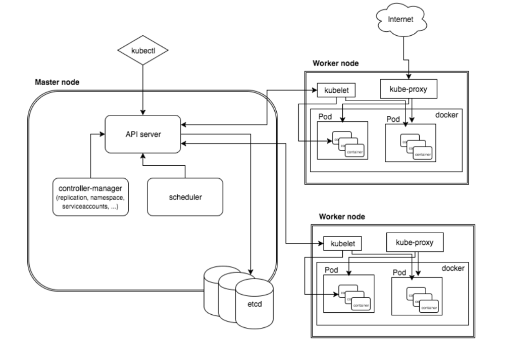

> 都是为了项目啊，不然实在是不想接触k8s这个东西的，虽然他是潮流

凡事先从历史说起，要理解`k8s`是什么，就先要理解它是怎么诞生的。先从`docker`说起，`docker`本身其实并不是容器，容器叫做`container`，而`docker`的本身是创建和管理`container`的工具，其设计的理念就是`Build(搭建)， Ship(运送)， Run(运行)`，前两者的对象其实应该算是一个`image`，而直到`Run`开始才涉及到`container`。
这儿就是需要明白的概念了：
1. `Image`：这个可以直接理解为一个具备配置的`文件系统`，这个配置包含了`文件系统`的构成，系统资源的使用等等
2. `Container`：本质上来说是`namespace`隔离，由一个程序作为原点而创建出来的整个隔离环境，而又因为其具备自身的`lfs`因而能够像是一个独立系统一样被使用

> 就不说后面`docker`被开源的事了，这些需要自己去了解

最初`docker`使用是很单纯的，就是找到一个`image`，然后`run`成一个`container`，各自玩各自的，但是随着`微服务`等概念的兴起，逐渐的`container`与`container`之间的关系就逐渐变的复杂起来，有时候需要相互依赖，有时候需要相互制约，有时候不同的`container`之间的网络需要按照一定的规则进行配置，这些`container`都是按照相同的`image`启动的，那么自然只能通过控制不同的启动配置来达成这一目的，但是一个个容器进行配置启动的方式尤为低效，尤其在面对同时启动成千上百个容器的时候，显然是不现实的，因此就需要一个工具能够对容器进行编排，让这些容器按照既定的规则启动运行。同样的受限于实际情况，不可能所有的容器都运行在一个主机上，但是不同主机上的两个容器之间很有可能有关联，那么如何统一管理调度呢？这同样需要有一个工具来解决这件事，因此`k8s`出场了，也就是`基于容器的集群管理平台`。

`k8s`弱化了`物理机`的概念，就使得管理手段从单一的`物理机`上执行命令变成了集群调度，很多东西的聚合才能叫做集群，而这个东西在`k8s`中被称为`节点`：
1. `Master`节点
2. `Node`节点

之前说过`k8s`弱化了`物理机`的概念，其实说的可能不太完全，应该是说`k8s`弱化了`操作系统`的概念，它只在乎其载体能够提供出来的资源而并不关注其本身的交互性，因此一个个`物理机`或者是`VM`成为了一个无情的资源节点，唯一的用处就是提供出能够量化的`内存`，`cpu`，`网络`等资源以供调度使用。
工具之所以叫工具是因为其能够被使用，因此`k8s`本身自然需要提供出一个能够被使用的接口出来，如果所有的节点都成了资源提供者，那么谁来提供交互呢？因此一个唯一的`Master`节点就被独立了出来，它上面提供了`apiserver`，`scheduler`，`controller manger`和`etcd`：
1. `apiserver`：对外交互的接口，使用者可以通过这个接口发出自己对整个集群的调度指令
2. `scheduler`：调度器，为`pod`负责，根据各种调度算法给`pod`安排`node`
3. `controller manger`：`pod`管理器
4. `etcd`：存储系统或者说是同步机，保存了当前所有的集群数据

这是控制端的组成，而`node`节点的组成就完全就是个工具人了。
1. `kubelet`：可以理解为在`node`节点中的一个长期进程，负责监控与管理`pod`
2. `container runtime`：提供容器的组件，可以是docker或者一些其他什么玩意，能够创建`container`
3. `kube-proxy`：为`pod`提供代理

上面提到了好多次`pod`，那这究竟是个什么呢？如果说对于`docker`来说最小的管理单位是一个个的`container`的话，那对于`k8s`来说最小的管理单位就是`pod`，为什么不是`container`呢？这个涉及到`container`理念即`单进程模型`，也就是说对于一个`container`来说其中只有一个`进程`在运行，然而每一个`container`都有属于自己的`namespace`，仅仅只是为了跑一个进程其实上是有些浪费的，因此`k8s`转换了思想，一个`pod`中存在一个或者多个`container`，他们共享`namespace`，也就是说`pod`更像是一个个虚拟机，而`container`则是其中的一个个进程，但是要明白一点的是这儿是通过约束来实现而非直接通过`隔离技术`实现，因为直接控制`namespace`这个能力应该是`k8s`不具备的。
> 就`k8s`官方的建议来说是一个`pod`一个`container`

直接创建流程上来说明也许更为直观:
> 借用[k8s创建pod流程]([https://www.cnblogs.com/girl1314/p/10647408.html](https://www.cnblogs.com/girl1314/p/10647408.html))的图和解释

step.1
kubectl 向 k8s api server 发起一个create pod 请求(即我们使用Kubectl敲一个create pod命令) 。
step.2
k8s api server接收到pod创建请求后，不会去直接创建pod；而是生成一个包含创建信息的yaml。
step.3
apiserver 将刚才的yaml信息写入etcd数据库。到此为止仅仅是在etcd中添加了一条记录， 还没有任何的实质性进展。
step.4
scheduler 查看 k8s api ，类似于通知机制。
首先判断：pod.spec.Node == null?
若为null，表示这个Pod请求是新来的，需要创建；因此先进行调度计算，找到最“闲”的node。
然后将信息在etcd数据库中更新分配结果：pod.spec.Node = nodeA (设置一个具体的节点)
ps:同样上述操作的各种信息也要写到etcd数据库中中。
step.5
kubelet 通过监测etcd数据库(即不停地看etcd中的记录)，发现 k8s api server 中有了个新的Node；
如果这条记录中的Node与自己的编号相同(即这个Pod由scheduler分配给自己了)；
则调用node中的docker api，创建container。

# 参考资料
* [Kubernetes是什么]([http://docs.kubernetes.org.cn/227.html](http://docs.kubernetes.org.cn/227.html))
* [k8s调度器kube-scheduler]([https://www.cnblogs.com/kcxg/p/11119679.html](https://www.cnblogs.com/kcxg/p/11119679.html))
* [k8s的pod的理解]([https://www.cnblogs.com/yechen2019/p/12103912.html](https://www.cnblogs.com/yechen2019/p/12103912.html))
* [k8s创建pod流程]([https://www.cnblogs.com/girl1314/p/10647408.html](https://www.cnblogs.com/girl1314/p/10647408.html))
* [minikube快速搭建k8s（一）]([https://blog.csdn.net/u014636124/article/details/105145674/](https://blog.csdn.net/u014636124/article/details/105145674/))
* [kubernetes CRI 前世今生]([https://www.cnblogs.com/justinli/p/cri.html](https://www.cnblogs.com/justinli/p/cri.html))