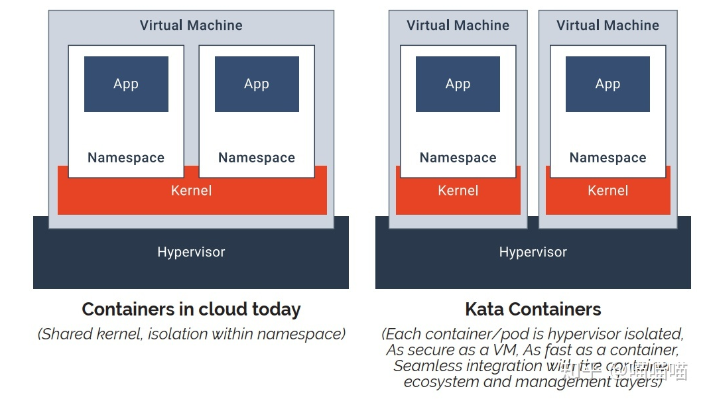
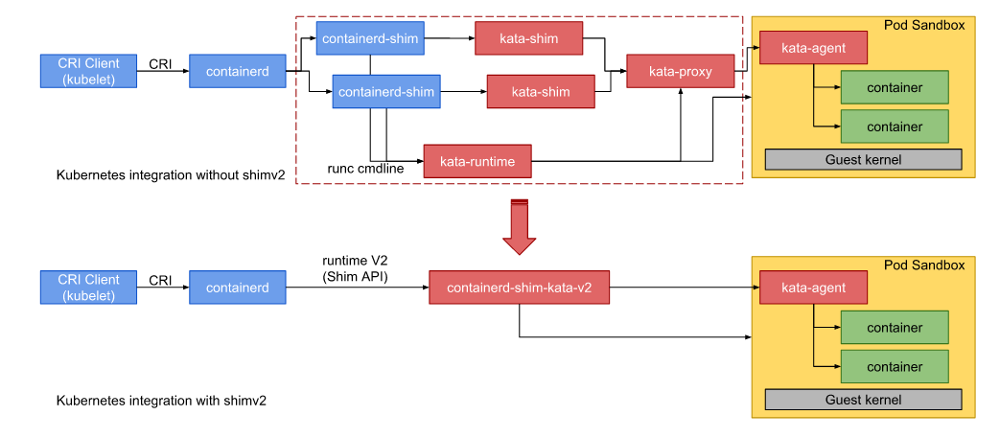
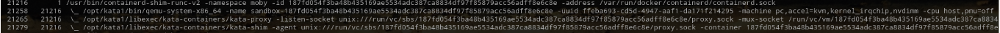
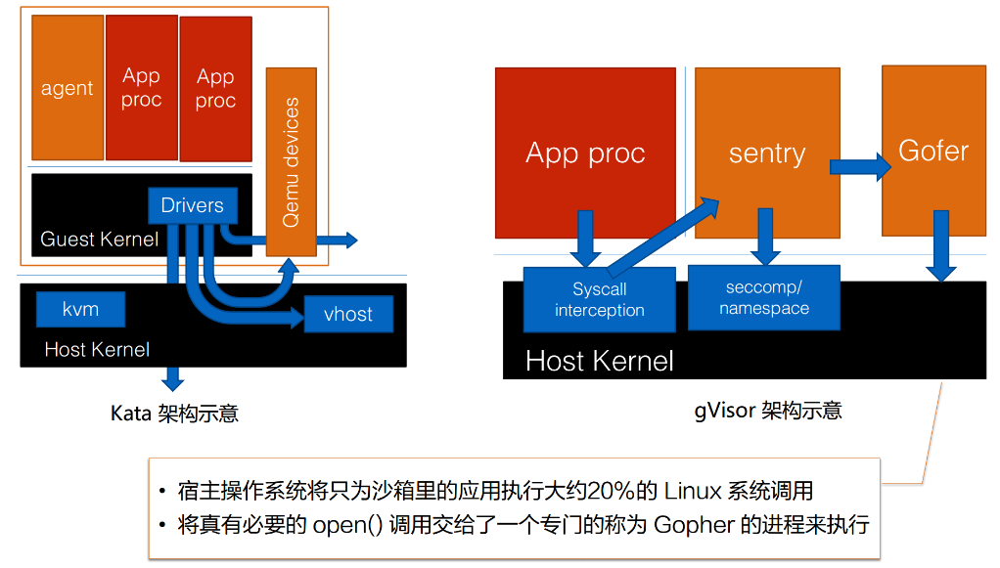

# 前言
把lxc，docker这些定义为传统容器的话，那kata container，gvisor就是现在很多人所说的安全容器，但是仅从我本人的观点来说对目前市场上的安全容器技术都并不是很看好。众所周知传统容器的核心隔离技术是通过linux的namespace机制但这无法解决的问题就是--“共享内核”，也就是常说的当一个已经被窃取权限的容器跑在了一个存在内核漏洞的系统上时，那么攻击者就能够通过侵入内核来影响到所有的容器业务，也因为这样所以传统容器在现在云场景越来越多的情况下其实是饱受诟病的。


2015年Linus在LinuxCon上提出了一个观念：
* 安全问题的唯一正解在于允许那些（导致安全问题的）Bug 发生，但通过额外的隔离层来阻挡住它们。


这句话就被后来的一些安全从业者奉为圭臬，也就在这种思想导致了kata和gvisor两种安全容器的出现
> 吐槽一下，就我本人来讲linus这个有甩锅嫌疑，因为他本人一直很讨厌安全人员，因为这些人总是会对他的内核带来的各种困扰而非帮助
# kata Container
kata container是一个奔着解决问题而诞生的缝合产物，它是由Clear Container和runV合并而来以hypervisor的名义插入了容器编排的场景里。





kata实质解决的是共享内核的问题，那么是怎么解决的呢？依靠的是将容器运行到一个vm中(默认是用的qemu)，但是为了要满足现有的编排方式或是说它一开始就是奔着k8s标准去的因此他实现了OCI，但是vm启动不够快且占资源怎么办？kata的团队针对kernel和vm都进行了剪裁以此来尽可能提高启动速度与降低资源占用。




> kata 2.0因为使用了shimv2的原因不再支持docker了，或者该反过来说？


它最主要的卖点就是一句话： `The speed of containers, the security of VMs`
和容器比，它性能还算可以，同时操作体验差不多，兼容容器的这一套玩法。同时它和VM一样安全。


而与VM相比，它比VM轻量化许多，启动速度更好，开销更低。


安全体现在：
* 用的是VM的硬件虚拟化支持，硬件隔离。
* `没有共享kernel`，不依赖于内核的namespace这种软件层面的隔离。


那容器体现在哪里： 兼容性上：支持OCI以及CRI接口，和容器一样操作。 性能上：启动速度达到百毫秒级，接近容器。 开销上：内存开销小，类似容器。


## kata的使用
从开源项目或者包管理器中可以直接下载安装kata将其保存到指定的目录下，然后修改docker的配置：


```
{


    "runtimes": {


  "kata":{


   "path": "/opt/kata/bin/kata-runtime"


  }


    }


}


```
启动


```
#systemctl daemon-reload


#systemctl restart docker


#docker run --rm -it --runtime="kata" ubuntu


```

## 想法
对于kata container有什么想法呢？它的诞生无疑是很大程度上解决了传统容器上的安全问题，但是为了要融入容器这个概念中，它需要重新诠释容器因此现在很多人将其描述成安全容器以与传统容器分别开来，这些都是布道者们去操心的事情与我无关，但是从一个底层使用上来说我对kata container的观感已经对其未来都是不看好的，利用vm隔离了内核实质上会导致namespace这个技术鸡肋化，且对于宿主机来说容器环境重新变成了一个黑盒里面到底发生了什么不再被人所知，这就导致如果发生了问题会极大的增加排查难度更增加运维成本。


从技术角度讲，kata没有发展出什么新的技术或者概念，而是在融合现有的能力将其产品化，为了贴合云原生它实现了CRI/OCI/CNI，为了能隔离内核它使用了现有的vm能力比如qemu，比如cloud hypervisor，为了依然能够使用到镜像编排能力，它还是再次使用了namespace，为了文件的传输使用了9pfs。


也许在最初还是runV的时候它便走错了道路，vm的形式决定了它的上限，因此kata container或许是一个好的产品，但绝不是一个好的技术方向。


# gVisor



Google gVisor 是 GCP App Engine、Cloud Functions Cloud Run 和 CloudML 中使用的沙箱技术，正式商用名称是 Google Sandbox。Google 意识到在公有云基础设施中运行不受信容器的风险，以及虚拟机沙箱的低效，因此开发了用户空间的内核作为沙箱来运行不受信应用。gVisor 是沿着 libdune 的系统调用拦截思路发展而来的用户态内核或进程虚拟化技术。gVisor 通过拦截所有从应用到主机内核的系统调用，并使用用户空间中 gVisor 的内核实现来处理这些调用。


如果是kata是让每一个容器都有一个自己的内核，那么gVisor的思路就是容器之间仍然共享内核，但是每个容器都会有一个内核代理，所有的系统调用都会通过这个代理藉此来做到针对容器的限制。那么核心技术就是如何拦截容器应用的系统调用？
* ptrace
* kvm


gVisor会提供两个进程来处理容器针对内核的访问:
* sentry
* Gofer


通过KVM的方式sentry会劫持到容器进程的syscall，并且sentry自身实现了一部分内核的功能诸如进程管理，基础系统调用的实现，总的来说gVisor 的设计就是让应用对那些并不常用的 Syscall 的访问根本就到不了操作系统层面，而只在 sentry 里就把它处理掉。而诸如open这样常用却又不太安全的syscall，gVisor 的开发者就单独地把它放到了一个独立的进程里面去实现，这个进程叫做 Gofer。一个独立的进程实际上是更容器被 seccomp、被一些系统的限制、一些 "capbility drop" 来保护。Gofer 可以做更少的事情，可以用非 root 去执行，如此一来整个系统的安全性就被进一步地被提高了。


从技术角度上来阐述的话，gVisor的实现其实是非常复杂的，因为它不仅要考虑到代理能力的实现，还要考虑自身的运行态切换，比如Guest中的ring0和Host态中的ring3，同时还要实现页表映射劫持到的程序的代码且不能相互干扰因此其目前的开销并不理想。


再退一步说容器进程能够用到的syscall最终还是得通过sentry传到真正的内核中的，那么sentry只能是当前内核支持的系统调用的子集。


## 想法
对于gVisor来说技术力是最大的障碍，虽然是内核代理但是也相当于是在重实现一部分的内核能力，且现在系统调用高达300多个而需要通过一个进程cover住，这种技术力需求直接就能劝退全世界百分之九十九的公司与开发者。


相比于kata来说，gVisor无疑架构能加漂亮，实现更加优雅，但是其超高的技术需求与当前依旧无法得到解决的性能开销使得目前的依旧只是一个花瓶的地位而不堪大用